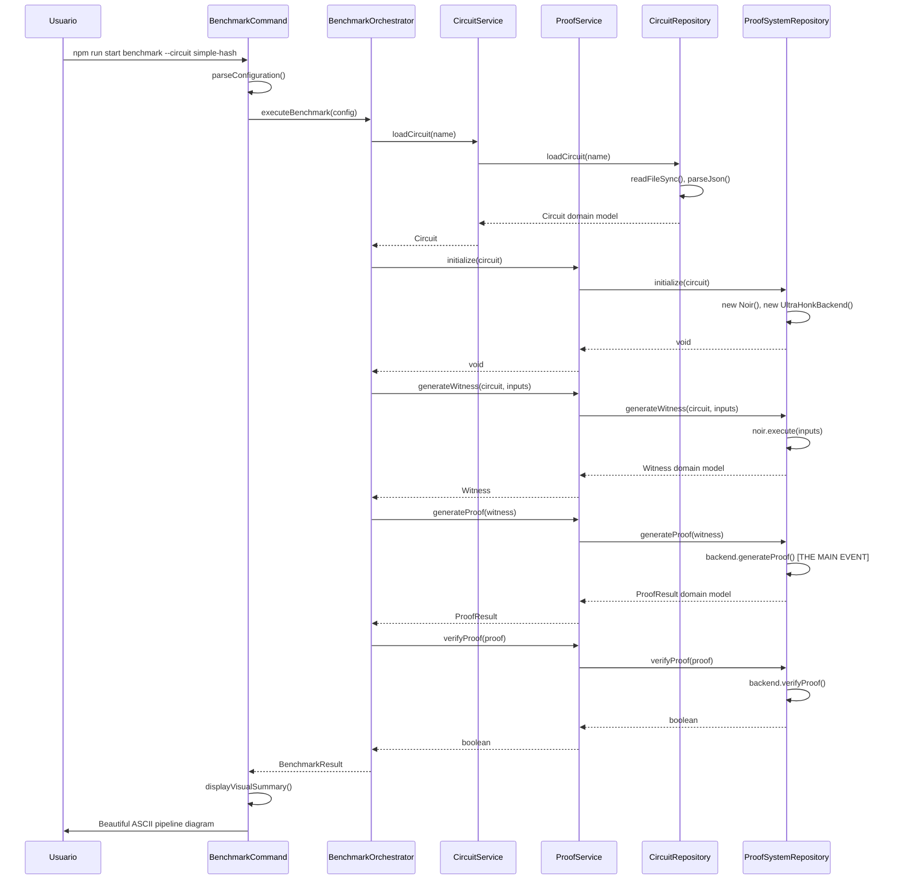

# 🏗️ Architecture Documentation

> **Clean Architecture implementation for NoirJS Benchmark CLI**

Este documento describe la arquitectura completa del NoirJS Benchmark CLI, implementando principios de Clean Architecture y Domain-Driven Design para crear un sistema mantenible, testeable y escalable.

## 📋 Tabla de Contenidos

- [Visión General](#visión-general)
- [Principios Arquitectónicos](#principios-arquitectónicos)
- [Estructura de Capas](#estructura-de-capas)
- [Domain Layer](#domain-layer)
- [Application Layer](#application-layer)
- [Infrastructure Layer](#infrastructure-layer)
- [Presentation Layer](#presentation-layer)
- [Shared Layer](#shared-layer)
- [Flujo de Datos](#flujo-de-datos)
- [Patrones Implementados](#patrones-implementados)
- [Decisiones Arquitectónicas](#decisiones-arquitectónicas)

## 🎯 Visión General

### Objetivos de la Arquitectura
1. **Separación de Responsabilidades**: Cada capa tiene un propósito específico y bien definido
2. **Testabilidad**: Fácil testing unitario e integración mediante dependency injection
3. **Mantenibilidad**: Código organizado y fácil de extender
4. **Escalabilidad**: Arquitectura que permite crecimiento sin refactoring mayor
5. **Domain-Centric**: El dominio del negocio (benchmarking ZK) está en el centro

### Stack Tecnológico
- **Lenguaje**: TypeScript (ES2022)
- **Runtime**: Node.js 18+
- **Arquitectura**: Clean Architecture + DDD
- **CLI Framework**: Commander.js
- **ZK Stack**: NoirJS + Barretenberg (UltraHonk)
- **Visual Experience**: ASCII Art + Chalk (colores)

## 🧱 Principios Arquitectónicos

### Clean Architecture
Implementamos los principios de Robert C. Martin:

1. **Dependency Rule**: Las dependencias apuntan hacia adentro (hacia el dominio)
2. **Independence**: Cada capa es independiente de frameworks externos
3. **Testability**: Fácil testing de business rules sin UI o base de datos
4. **Framework Independence**: El dominio no depende de frameworks específicos

### Domain-Driven Design
Aplicamos conceptos clave de DDD:

1. **Ubiquitous Language**: Vocabulario común entre negocio y desarrollo
2. **Rich Domain Models**: Entidades con comportamiento, no solo datos
3. **Repository Pattern**: Abstracción del acceso a datos
4. **Value Objects**: Objetos inmutables con validación intrínseca

### SOLID Principles
- **S**ingle Responsibility: Cada clase tiene una sola razón para cambiar
- **O**pen/Closed: Abierto para extensión, cerrado para modificación
- **L**iskov Substitution: Objetos reemplazables por instancias de subtipos
- **I**nterface Segregation: Interfaces específicas mejor que generales
- **D**ependency Inversion: Depender de abstracciones, no concreciones

## 🏛️ Estructura de Capas

```
src/
├── 🔵 domain/              # Capa de Dominio (Core Business)
│   ├── models/            #   Entidades y Value Objects
│   └── repositories/      #   Contratos de repositorio
├── 🟢 application/         # Capa de Aplicación (Use Cases)
│   ├── services/          #   Servicios de aplicación
│   └── orchestrators/     #   Orquestación de workflows complejos
├── 🟡 infrastructure/      # Capa de Infraestructura (External Concerns)
│   ├── circuit/           #   Implementación de repositorio de circuitos
│   ├── noir/              #   Integración con NoirJS/Barretenberg
│   └── profiling/         #   Profiling de rendimiento con Node.js
├── 🔴 presentation/        # Capa de Presentación (User Interface)
│   └── cli/               #   Comandos CLI y manejo de entrada
├── ⚫ shared/              # Utilidades Compartidas (Cross-cutting)
│   ├── visual/            #   ASCII Art y elementos visuales
│   ├── logger/            #   Sistema de logging avanzado
│   └── errors/            #   Jerarquía de errores del dominio
└── 📄 main.ts             # Entry Point + Dependency Injection Container
```

### Flujo de Dependencias
```
Presentation Layer 
       ↓
Application Layer
       ↓  
Domain Layer
       ↑
Infrastructure Layer
```

**Regla Clave**: Las flechas siempre apuntan hacia el dominio. Infrastructure implementa interfaces definidas en Domain.

## 🔵 Domain Layer

### Propósito
Contiene la lógica de negocio core y reglas del dominio del benchmarking ZK. Es la capa más importante y estable.

### Componentes

#### Models (`src/domain/models/`)

**Circuit.ts** - Entidad principal del dominio
```typescript
export class Circuit {
  constructor(
    public readonly name: string,
    public readonly bytecode: Uint8Array,
    public readonly abi: any,
    public readonly constraints: number,
    public readonly bytecodeSize: number
  ) {
    // Validación de invariantes del dominio
    if (!name.trim()) throw new Error('Circuit name cannot be empty');
    if (bytecode.length === 0) throw new Error('Circuit bytecode cannot be empty');
  }
  
  get complexity(): 'simple' | 'medium' | 'complex' {
    // Lógica de negocio para clasificar complejidad
    if (this.constraints < 100) return 'simple';
    if (this.constraints < 1000) return 'medium';
    return 'complex';
  }
  
  static fromCompiledCircuit(name: string, compiledCircuit: any): Circuit {
    // Factory method con validación específica del dominio
  }
}
```

**BenchmarkResult.ts** - Agregado principal de resultados
```typescript
export class BenchmarkResult {
  constructor(
    public readonly circuitName: string,
    public readonly backend: string,
    public readonly stages: BenchmarkStage[],
    public readonly totals: BenchmarkTotals,
    public readonly metadata: BenchmarkMetadata
  ) {}
  
  // Business logic: Calcular % de tiempo en proof generation
  get proofGenerationPercentage(): number {
    const proofStage = this.stages.find(s => s.name === 'proof-generate');
    return proofStage ? (proofStage.timeMs / this.totals.timeMs) * 100 : 0;
  }
  
  // Insight clave del dominio: Proof gen domina el tiempo
  get isProofGenerationBottleneck(): boolean {
    return this.proofGenerationPercentage > 75;
  }
}
```

**ProofResult.ts & Witness.ts** - Value Objects
```typescript
export class ProofResult {
  constructor(
    public readonly proof: Uint8Array,
    public readonly publicInputs: Uint8Array,
    public readonly generationTimeMs: number,
    public readonly verified: boolean = false
  ) {
    // Invariantes del dominio
    if (proof.length === 0) throw new Error('Proof cannot be empty');
    if (generationTimeMs < 0) throw new Error('Generation time cannot be negative');
  }
  
  get proofSize(): number { return this.proof.length; }
  get isValid(): boolean { return this.verified && this.proof.length > 0; }
}
```

#### Repositories (`src/domain/repositories/`)

**CircuitRepository.ts** - Contrato para acceso a circuitos
```typescript
export interface CircuitRepository {
  loadCircuit(name: string): Promise<Circuit>;
  getTestInputs(circuitName: string): Promise<Record<string, any>>;
  listAvailableCircuits(): Promise<string[]>;
}
```

**ProofSystemRepository.ts** - Contrato para sistemas de prueba
```typescript
export interface ProofSystemRepository {
  initialize(circuit: Circuit): Promise<void>;
  generateWitness(circuit: Circuit, inputs: Record<string, any>): Promise<Witness>;
  generateProof(witness: Witness): Promise<ProofResult>;
  verifyProof(proofResult: ProofResult): Promise<boolean>;
  cleanup(): Promise<void>;
  getBackendInfo(): { name: string; version: string };
}
```

### Características del Domain
- **Framework Independent**: No depende de Node.js, NoirJS, o CLI frameworks
- **Rich Models**: Entidades con comportamiento, no solo data bags
- **Invariants**: Validación de reglas de negocio en constructores
- **Pure Business Logic**: Solo lógica relacionada con benchmarking ZK

## 🟢 Application Layer

### Propósito
Orquesta los use cases del sistema, coordinando entre dominio e infraestructura. Implementa los workflows específicos de la aplicación.

### Componentes

#### Services (`src/application/services/`)

**CircuitService.ts** - Use cases relacionados con circuitos
```typescript
export class CircuitService {
  constructor(
    private readonly circuitRepository: CircuitRepository,
    private readonly logger: Logger
  ) {}
  
  async loadCircuit(name: string): Promise<Circuit> {
    this.logger.debug(`Loading circuit: ${name}`);
    try {
      const circuit = await this.circuitRepository.loadCircuit(name);
      this.logger.debug(`Circuit loaded successfully: ${circuit.constraints} constraints`);
      return circuit;
    } catch (error) {
      throw new CircuitNotFoundError(name, error as Error);
    }
  }
  
  async listAvailableCircuits(): Promise<string[]> {
    // Use case: listar todos los circuitos disponibles
    return this.circuitRepository.listAvailableCircuits();
  }
}
```

**ProofService.ts** - Use cases de generación de pruebas
```typescript
export class ProofService {
  constructor(
    private readonly proofSystemRepository: ProofSystemRepository,
    private readonly logger: Logger
  ) {}
  
  async initialize(circuit: Circuit): Promise<void> {
    await this.proofSystemRepository.initialize(circuit);
    const backendInfo = this.proofSystemRepository.getBackendInfo();
    this.logger.debug(`Initialized ${backendInfo.name} v${backendInfo.version}`);
  }
  
  async generateProof(witness: Witness): Promise<ProofResult> {
    // Use case principal: generar prueba ZK
    const result = await this.proofSystemRepository.generateProof(witness);
    
    if (result instanceof FailedProofResult) {
      throw new ProofGenerationError(result.error);
    }
    
    return result;
  }
}
```

#### Orchestrators (`src/application/orchestrators/`)

**BenchmarkOrchestrator.ts** - Workflow completo de benchmarking
```typescript
export class BenchmarkOrchestrator {
  constructor(
    private readonly circuitService: CircuitService,
    private readonly proofService: ProofService,
    private readonly performanceProfiler: PerformanceProfiler,
    private readonly logger: Logger
  ) {}
  
  async executeBenchmark(config: BenchmarkConfiguration): Promise<BenchmarkResult> {
    const allResults: BenchmarkResult[] = [];
    
    // Orchestrate the complete benchmark workflow
    for (let i = 0; i < config.runs; i++) {
      const result = await this.executeSingleRun(config);
      allResults.push(result);
    }
    
    return this.aggregateResults(allResults, config);
  }
  
  private async executeSingleRun(config: BenchmarkConfiguration): Promise<BenchmarkResult> {
    // Orquesta el pipeline completo:
    // 1. Load Circuit
    // 2. Initialize Backend  
    // 3. Generate Witness
    // 4. Generate Proof (THE MAIN EVENT)
    // 5. Verify Proof
    
    const stages: BenchmarkStage[] = [];
    
    // Stage 1: Load Circuit
    const loadResult = await this.performanceProfiler.timeStage('circuit-load', async () => {
      return this.circuitService.loadCircuit(config.circuitName);
    });
    stages.push(this.convertToStage(loadResult));
    
    // ... resto del pipeline
    
    return new BenchmarkResult(config.circuitName, config.backend, stages, totals, metadata);
  }
}
```

### Características de Application
- **Use Case Oriented**: Cada método representa un caso de uso específico
- **Orchestration**: Coordina múltiples servicios de dominio e infraestructura
- **Transaction Boundaries**: Maneja transacciones y consistency boundaries
- **Error Handling**: Convierte errores de infraestructura en errores de dominio

## 🟡 Infrastructure Layer

### Propósito
Implementa las interfaces definidas en el dominio, integrándose con frameworks externos, sistemas de archivos, y APIs de terceros.

### Componentes

#### Circuit (`src/infrastructure/circuit/`)

**FileSystemCircuitRepository.ts** - Implementación de acceso a archivos
```typescript
export class FileSystemCircuitRepository implements CircuitRepository {
  async loadCircuit(name: string): Promise<Circuit> {
    const circuitPath = resolve(this.circuitsDir, name, 'target', `${name.replace('-', '_')}.json`);
    const proverPath = resolve(this.circuitsDir, name, 'Prover.toml');
    
    if (!existsSync(circuitPath)) {
      throw new Error(`Circuit JSON not found: ${circuitPath}`);
    }
    
    const circuitJson = JSON.parse(readFileSync(circuitPath, 'utf-8'));
    const inputs = this.parseProverToml(readFileSync(proverPath, 'utf-8'));
    
    return Circuit.fromCompiledCircuit(name, circuitJson);
  }
  
  private parseProverToml(content: string): Record<string, any> {
    // Parsing específico de TOML para inputs de Noir
    // Maneja hex values, booleans, arrays, etc.
  }
}
```

#### NoirJS Integration (`src/infrastructure/noir/`)

**UltraHonkProofSystemRepository.ts** - Integración con NoirJS + Barretenberg
```typescript
export class UltraHonkProofSystemRepository implements ProofSystemRepository {
  private backend: UltraHonkBackend | null = null;
  private noir: Noir | null = null;
  
  async initialize(circuit: Circuit): Promise<void> {
    // Convert Domain Circuit to NoirJS format
    const bytecodeString = Buffer.from(circuit.bytecode).toString('base64');
    const compiledCircuit: CompiledCircuit = {
      bytecode: bytecodeString,
      abi: circuit.abi,
      debug_symbols: '',
      file_map: {}
    };
    
    // Initialize NoirJS and UltraHonk backend
    this.noir = new Noir(compiledCircuit);
    this.backend = new UltraHonkBackend(bytecodeString);
  }
  
  async generateProof(witness: Witness): Promise<ProofResult> {
    if (!this.backend) throw new ProofGenerationError('Backend not initialized');
    
    const startTime = performance.now();
    const proofData: ProofData = await this.backend.generateProof(witness.data);
    const generationTime = performance.now() - startTime;
    
    // Convert ProofData format to Domain ProofResult
    const publicInputsBytes = new TextEncoder().encode(JSON.stringify(proofData.publicInputs));
    return new ProofResult(proofData.proof, publicInputsBytes, generationTime);
  }
}
```

#### Profiling (`src/infrastructure/profiling/`)

**PerformanceProfiler.ts** - Profiling con Node.js APIs
```typescript
export class PerformanceProfiler {
  async timeStage<T>(stageName: string, asyncFn: () => Promise<T>): Promise<StageResult<T>> {
    const memoryBefore = process.memoryUsage();
    const startTime = performance.now();
    
    // Performance marks para análisis detallado
    performance.mark(`${stageName}-start`);
    
    try {
      const result = await asyncFn();
      const endTime = performance.now();
      const memoryAfter = process.memoryUsage();
      
      performance.mark(`${stageName}-end`);
      performance.measure(stageName, `${stageName}-start`, `${stageName}-end`);
      
      return {
        stage: stageName,
        timeMs: endTime - startTime,
        memoryBefore,
        memoryAfter,
        memoryDelta: this.calculateDelta(memoryBefore, memoryAfter),
        result
      };
    } catch (error) {
      // Error handling con cleanup de marks
      performance.mark(`${stageName}-end`);
      throw error;
    }
  }
}
```

### Características de Infrastructure
- **External Dependencies**: Integra con NoirJS, file system, Node.js APIs
- **Concrete Implementations**: Implementa contratos definidos en Domain
- **Error Translation**: Convierte errores externos en errores del dominio
- **Resource Management**: Maneja recursos externos (WASM, memoria, archivos)

## 🔴 Presentation Layer

### Propósito
Maneja la interacción con el usuario, parseando comandos CLI y presentando resultados usando la nueva experiencia visual.

### Componentes

#### CLI (`src/presentation/cli/`)

**BenchmarkCommand.ts** - Comando principal de benchmarking
```typescript
export class BenchmarkCommand {
  constructor(
    private readonly benchmarkOrchestrator: BenchmarkOrchestrator,
    private readonly logger: Logger
  ) {}
  
  register(program: Command): void {
    program
      .command('benchmark')
      .description('Run a benchmark test')
      .option('-c, --circuit <name>', 'Circuit to benchmark', 'simple-hash')
      .option('-r, --runs <number>', 'Number of runs', '1')
      .option('--verbose', 'Verbose output')
      .action(async (options: CommandOptions) => {
        await this.execute(options);
      });
  }
  
  private async execute(options: CommandOptions): Promise<void> {
    const config = this.parseConfiguration(options);
    
    // Visual experience starts here
    this.logger.banner();
    this.logger.config(config.circuitName, config.backend, config.runs, config.threads);
    
    // Execute benchmark through application layer
    const result = await this.benchmarkOrchestrator.executeBenchmark(config);
    
    // Display results with visual pipeline
    this.displayVisualSummary(result);
  }
  
  private displayVisualSummary(result: BenchmarkResult): void {
    // Prepare data for visual pipeline diagram
    const stages = result.stages.map(stage => ({
      name: this.getStageDisplayName(stage.name),
      time: Math.round(stage.timeMs),
      memory: Math.round(stage.memoryUsage.after.heapUsed / 1024 / 1024),
      percentage: parseFloat((stage.timeMs / result.totals.timeMs * 100).toFixed(1)),
      isMain: stage.name === 'proof-generate'
    }));
    
    // Display beautiful ASCII pipeline
    this.logger.pipelineFlow(stages);
    this.logger.visualSummary(/* ... */);
  }
}
```

### Características de Presentation
- **User Interface**: Única responsabilidad es la interacción con usuario
- **Input Parsing**: Convierte comandos CLI en objetos del dominio
- **Output Formatting**: Usa shared/visual para experiencia rica
- **Thin Layer**: Delega lógica de negocio a application layer

## ⚫ Shared Layer

### Propósito
Contiene utilidades cross-cutting que son usadas por múltiples capas, pero no contienen lógica de negocio específica.

### Componentes

#### Visual (`src/shared/visual/`)

**AsciiArt.ts** - Elementos visuales profesionales
```typescript
export class AsciiArt {
  static banner(title: string, subtitle: string): string {
    // Creates professional ASCII banner
  }
  
  static pipeline(stages: PipelineStage[]): string {
    // Creates visual pipeline flow diagram with:
    // - Connected boxes with arrows
    // - Stage 4 highlighted with double borders
    // - Time, memory, and percentage metrics
    // - "THE MAIN EVENT" emphasis
  }
  
  static summary(totalTime: number, peakMemory: number, proofSize: number): string {
    // Creates performance summary with insights
  }
}
```

**ProgressBar.ts** - Indicadores de progreso
```typescript
export class ProgressBar {
  static stageProgress(stageName: string, percentage: number, timeElapsed?: number): string {
    // Creates progress box with completion status
  }
  
  static status(type: 'pending' | 'running' | 'complete' | 'error', message: string): string {
    // Creates status indicators with appropriate icons
  }
}
```

#### Logger (`src/shared/logger/`)

**Logger.ts** - Sistema de logging avanzado
```typescript
export class Logger {
  // Standard logging methods
  info(message: string): void;
  error(message: string): void;
  debug(message: string): void;
  
  // Visual logging methods (NEW)
  banner(title?: string, subtitle?: string): void;
  config(circuit: string, backend: string, runs: number, threads: number): void;
  stageProgress(stageName: string, percentage: number, timeElapsed?: number): void;
  pipelineFlow(stages: PipelineStage[]): void;
  visualSummary(totalTime: number, peakMemory: number, proofSize: number): void;
  status(type: StatusType, message: string): void;
}
```

#### Errors (`src/shared/errors/`)

**BenchmarkError.ts** - Jerarquía de errores del dominio
```typescript
export abstract class BenchmarkError extends Error {
  constructor(message: string, public readonly code: string, public readonly cause?: Error) {
    super(message);
    this.name = this.constructor.name;
  }
}

export class CircuitNotFoundError extends BenchmarkError;
export class ProofGenerationError extends BenchmarkError;
export class WitnessGenerationError extends BenchmarkError;
export class ProofVerificationError extends BenchmarkError;
```

### Características de Shared
- **Cross-Cutting Concerns**: Logging, errores, visualización
- **No Business Logic**: Solo utilidades técnicas reutilizables
- **Framework Agnostic**: Pueden ser usadas en cualquier contexto
- **High Cohesion**: Cada módulo tiene una responsabilidad específica

## 📄 Entry Point & Dependency Injection

### main.ts - Application Bootstrap

```typescript
class Container {
  private logger: Logger;
  private circuitRepository: FileSystemCircuitRepository;
  private proofSystemRepository: UltraHonkProofSystemRepository;
  private performanceProfiler: PerformanceProfiler;
  private circuitService: CircuitService;
  private proofService: ProofService;
  private benchmarkOrchestrator: BenchmarkOrchestrator;
  private benchmarkCommand: BenchmarkCommand;
  
  constructor() {
    // Infrastructure layer - outer layer
    this.logger = new Logger();
    this.circuitRepository = new FileSystemCircuitRepository();
    this.proofSystemRepository = new UltraHonkProofSystemRepository();
    this.performanceProfiler = new PerformanceProfiler();
    
    // Application layer - uses domain interfaces
    this.circuitService = new CircuitService(this.circuitRepository, this.logger);
    this.proofService = new ProofService(this.proofSystemRepository, this.logger);
    
    // Application orchestrator
    this.benchmarkOrchestrator = new BenchmarkOrchestrator(
      this.circuitService,
      this.proofService, 
      this.performanceProfiler,
      this.logger
    );
    
    // Presentation layer - outermost layer
    this.benchmarkCommand = new BenchmarkCommand(this.benchmarkOrchestrator, this.logger);
  }
}
```

### Dependency Flow
```
main.ts (Container)
    │
    ├─ Creates Infrastructure implementations
    │   ├─ FileSystemCircuitRepository
    │   ├─ UltraHonkProofSystemRepository  
    │   ├─ PerformanceProfiler
    │   └─ Logger
    │
    ├─ Injects into Application services
    │   ├─ CircuitService(repository, logger)
    │   └─ ProofService(repository, logger)
    │
    ├─ Creates Application orchestrator
    │   └─ BenchmarkOrchestrator(services, profiler, logger)
    │
    └─ Injects into Presentation
        └─ BenchmarkCommand(orchestrator, logger)
```

## 🔄 Flujo de Datos

### Comando de Benchmark Completo



### Transformaciones de Datos

**1. File System → Domain**
```
circuits/simple-hash/target/simple_hash.json
    ↓ FileSystemCircuitRepository
Domain.Circuit {name, bytecode, abi, constraints}
```

**2. Domain → NoirJS**
```
Domain.Circuit 
    ↓ UltraHonkProofSystemRepository
NoirJS.CompiledCircuit {bytecode: string, abi, debug_symbols, file_map}
```

**3. NoirJS → Domain**
```  
NoirJS.ProofData {proof: Uint8Array, publicInputs: string[]}
    ↓ UltraHonkProofSystemRepository  
Domain.ProofResult {proof: Uint8Array, publicInputs: Uint8Array, timeMs}
```

**4. Domain → Visual**
```
Domain.BenchmarkResult
    ↓ BenchmarkCommand.displayVisualSummary()
ASCII Pipeline Diagram con colores y métricas
```

## 🎨 Patrones Implementados

### Repository Pattern
- **Propósito**: Encapsula acceso a datos y permite testing fácil
- **Implementación**: 
  - `CircuitRepository` interface en domain
  - `FileSystemCircuitRepository` implementation en infrastructure
- **Beneficio**: Fácil cambio a bases de datos o APIs remotas

### Dependency Injection
- **Propósito**: Inversión de control y desacoplamiento  
- **Implementación**: Manual DI container en `main.ts`
- **Beneficio**: Testing fácil con mocks, flexibilidad en runtime

### Factory Pattern
- **Propósito**: Creación de objetos complejos con validación
- **Implementación**: `Circuit.fromCompiledCircuit()`, `ProofResult.failed()`
- **Beneficio**: Construcción controlada con invariantes del dominio

### Strategy Pattern  
- **Propósito**: Algoritmos intercambiables
- **Implementación**: `ProofSystemRepository` permite diferentes backends
- **Beneficio**: Fácil soporte para UltraPlonk u otros backends

### Command Pattern
- **Propósito**: Encapsular requests como objetos
- **Implementación**: CLI commands como clases separadas
- **Beneficio**: Extensibilidad y testing de comandos individuales

### Observer Pattern
- **Propósito**: Notificación de cambios de estado
- **Implementación**: Performance Observer para profiling
- **Beneficio**: Monitoring no intrusivo de rendimiento

## 🎯 Decisiones Arquitectónicas

### 1. TypeScript + ES Modules
**Decisión**: Usar TypeScript con ES modules (no CommonJS)
**Razón**: 
- Type safety para dominio complejo (ZK proofs)
- ES modules es el futuro de JavaScript
- Mejor integración con tooling moderno
**Trade-off**: Requiere Node.js 18+ y configuración cuidadosa

### 2. Clean Architecture sobre MVC
**Decisión**: Implementar Clean Architecture completa
**Razón**:
- Separación clara de concerns
- Testabilidad superior
- Independence de frameworks
- Escalabilidad a largo plazo
**Trade-off**: Más boilerplate inicial, learning curve

### 3. Domain-Rich Models
**Decisión**: Modelos de dominio con comportamiento, no solo data
**Razón**:
- `Circuit.complexity()` encapsula lógica de negocio
- `BenchmarkResult.proofGenerationPercentage()` cálculos core
- Invariantes validados en constructores
**Trade-off**: Más código que simple DTOs

### 4. Manual Dependency Injection
**Decisión**: DI manual en lugar de framework (InversifyJS, etc.)
**Razón**:
- Simplicidad - proyecto no muy grande
- Control total sobre construction
- Sin magic/decorators complejos  
**Trade-off**: Más verboso, no auto-wiring

### 5. ASCII Art Visual Experience
**Decisión**: Experiencia visual rica en consola
**Razón**:
- Don Norman design principles aplicados
- Destacar Proof Generation como bottleneck
- Diferenciación vs herramientas similares
**Trade-off**: Más código, complejidad en layouts

### 6. Real NoirJS Integration (no mocks)
**Decisión**: Integración completa con NoirJS + Barretenberg
**Razón**:
- Métricas reales de rendimiento
- Validación con casos de uso reales  
- Foundation para herramienta de producción
**Trade-off**: Dependencias pesadas, setup más complejo

### 7. Performance-First Profiling
**Decisión**: Profiling detallado con Node.js performance APIs
**Razón**:
- Identificar bottlenecks reales
- Métricas accionables para optimización
- Insights de memoria y tiempo
**Trade-off**: Overhead de measurement, complejidad

## 📊 Métricas de Arquitectura

### Complejidad Ciclomática
- **Domain Layer**: Baja - lógica de negocio simple y clara
- **Application Layer**: Media - orquestación de workflows
- **Infrastructure Layer**: Media - integración con APIs externas  
- **Presentation Layer**: Baja - principalmente formatting

### Acoplamiento
- **Afferent Coupling (Ca)**: Domain = 0, Application = Domain, etc.
- **Efferent Coupling (Ce)**: Presentation = Application + Shared, etc.
- **Instability (I)**: Ce / (Ca + Ce) - Domain más estable

### Cobertura de Testing (Target)
- **Domain Layer**: 90%+ - crítico para business logic
- **Application Layer**: 85%+ - workflow orchestration  
- **Infrastructure Layer**: 70%+ - integración testing
- **Presentation Layer**: 60%+ - principalmente integration tests

## 🔮 Evolución de la Arquitectura

### Extensiones Futuras Preparadas

**1. Múltiples Backends**
```typescript
interface ProofSystemRepository {
  // Ya preparado para UltraPlonk, Halo2, etc.
}

class UltraPlonkProofSystemRepository implements ProofSystemRepository {
  // Easy to implement
}
```

**2. Remote Circuit Storage**
```typescript
class RemoteCircuitRepository implements CircuitRepository {
  constructor(private apiClient: ApiClient) {}
  // Fetch circuits from API/IPFS/etc.
}
```

**3. Database Results Storage**  
```typescript
class DatabaseBenchmarkRepository {
  async saveBenchmarkResult(result: BenchmarkResult): Promise<void>;
  async getBenchmarkHistory(circuit: string): Promise<BenchmarkResult[]>;
}
```

**4. Web Dashboard**
```typescript
class WebDashboardPresentation {
  // Same domain models, different presentation layer
  displayResults(result: BenchmarkResult): React.Component;
}
```

### Refactoring Paths
1. **Extract Configuration**: Config objects para diferentes entornos
2. **Add Events**: Domain events para auditing/monitoring
3. **Performance Optimization**: Caching layer para circuit loading
4. **Multi-threading**: Worker threads para proof generation paralela

---

## ✅ Conclusión

Esta arquitectura logra:

- **🎯 Separation of Concerns**: Cada capa tiene responsabilidad específica
- **🧪 Testability**: Easy unit testing con dependency injection  
- **🔧 Maintainability**: Código organizado y documentado
- **📈 Scalability**: Fácil agregar features sin romper existentes
- **🎨 User Experience**: Visual experience excepcional con principios de diseño
- **⚡ Performance**: Real benchmarking con métricas actionables

El resultado es una herramienta profesional que no solo funciona correctamente, sino que es mantenible, extensible y proporciona una experiencia de usuario excepcional para developers trabajando con Zero-Knowledge proofs.

**La arquitectura pone el dominio (ZK benchmarking) en el centro, con todas las demás capas sirviendo para soportar y exponer esa funcionalidad core de manera elegante y eficiente.**